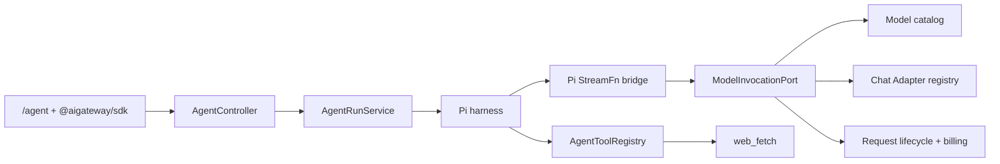

## Context

AI Gateway Studio 已有 `/chat`、`/image`、`/prompt` 专业页面以及稳定的 `@aigateway/sdk → NestJS → Adapter → provider` 调用链。当前 Chat 使用 assistant-ui LocalRuntime 管理浏览器内存消息，每个请求只执行一次模型流；它不提供服务端会话、工具调用循环、网页读取或断线后的运行恢复。

本 change 新增独立 `/agent`，以 `@earendil-works/pi-agent-core` 的 harness/Agent loop 作为服务端编排核心。Agent 面向通用助手场景，首个工具是 `web_fetch`；图片、视频、skills 和 MCP 后续通过相同 registry 扩展。GitHub 登录用户是唯一使用者，NestJS 继续是认证、计费、限流和数据真源。

约束包括：单机 4C8G 模块化单体、不使用 BullMQ/独立 Worker、不向浏览器暴露 provider/MCP 凭证、不破坏现有专业页面、API 重启时不恢复进行中的 Agent run。

## Goals / Non-Goals

**Goals:**

- 交付 `/agent → SDK → Agent API → Pi harness → Mock tool-calling model → web_fetch → follow-up turn → persisted events` 的确定性纵向切片。
- 将 Agent loop、tools 和未来 skills/MCP 集中在 NestJS 服务端，并保持 provider 类型只存在于 Adapter 层。
- 提供用户隔离的持久会话、可续读事件、折叠 reasoning、工具状态、取消和累计用量/费用。
- 让模型只能选择经过 tool-calling contract test 的模型实例，并将会话模型固定到创建时选择。
- 建立小而稳定的 Tool/Skill/MCP registry 端口，使后续能力不要求重写 Agent loop。

**Non-Goals:**

- 不替换 `/chat`，不改变多模型对比、Image 或 Prompt 页面行为。
- 不在本 change 实现图片/视频 Agent 工具、MCP 连接、skill 加载、用户自定义工具或工具审批。
- 不执行网页 JavaScript，不提供浏览器集群、搜索引擎、文件系统、shell、任意 SQL 或任意认证转发。
- 不支持运行中追加/steer/follow-up 消息，不支持同一用户并发 Agent run。
- 不实现会话分享、Agent run 后台队列、API 重启续跑或多机高可用。

## Decisions

### Decision 1: Pi harness runs in NestJS

`AgentModule` 在服务端创建 Pi Agent/loop，Web 只通过 SDK 创建 run、订阅事件和取消。这样 provider/MCP 凭证、工具实现、运行上限、用户级并发锁、日志和费用都位于可信边界内，且浏览器断线不终止进程内 run。

备选的浏览器 harness 会让页面关闭即终止、限制可被篡改、MCP 凭证更难保护，并需要双端协调持久事件，因此不采用。Pi 的 coding agent、TUI 和内置本地文件/shell 工具不作为依赖。

### Decision 2: Agent reuses an internal model invocation port

AgentModule 不通过 HTTP 调用本机 `/api/v1/chat/completions`，也不让 Pi 直接持有 provider API Key。现有 Chat 编排中可复用的模型解析、Adapter、限流、RequestLifecycle 和计费能力应提取为内部 `ModelInvocationPort`。普通 Chat Controller 和 Agent runtime 都依赖该端口：



Pi `StreamFn` bridge 在 Pi 的 `Context/AssistantMessageEvent` 与平台内部 tool-calling 事件之间转换。公共 `@aigateway/sdk` 不暴露 Pi `Model`、`Context` 或 `AgentTool` 类型，避免 SDK 被 Pi 实现绑定。

### Decision 3: Tool calling is a provider-neutral internal contract

模型目录为模型实例增加 `agent` capability。只有启用、已配置且通过 tool-calling contract test 的实例可创建 Agent thread。统一内部模型请求支持 system prompt、user/assistant/tool-result messages、JSON Schema tools 和 tool choice；统一流支持 text、reasoning、tool-call、usage、finish 和 error。各 provider Adapter 映射自己的协议，业务 Service 不读取厂商响应类型。

Mock Adapter 必须确定性模拟：文本直答、一次 `web_fetch` 后完成、多个 fetch、无效参数、未知工具、模型流错误、超限和取消。单模型首 delta failover 规则不得把两个 provider 的 tool call 拼接为同一响应；发生 provider 切换时必须尚未向 Pi bridge 提交任何 text/reasoning/tool-call delta。

### Decision 4: Threads, runs, messages and events are persisted separately

建议 Prisma 实体：

| Entity | Purpose and invariants |
| --- | --- |
| `AgentThread` | 所有者、固定 modelId、标题、createdAt/updatedAt；软状态不承担运行锁 |
| `AgentMessage` | thread 内有序 user/assistant/tool message；内容由 parts JSON 表达 |
| `AgentRun` | 一次用户提交的运行、状态、计数、累计 usage/cost、开始/结束时间和停止原因 |
| `AgentEvent` | run 内单调递增 sequence、事件类型和 payload；唯一 `(runId, sequence)` |
| `AgentToolCall` | tool call ID、工具名、校验后参数、状态、截断结果摘要、时间和错误 |

消息 parts 至少支持 `text`、`reasoning`、`tool-call`、`tool-result`。Reasoning 只保存 provider 明确返回的字段，独立限长，默认折叠，仅返回会话所有者，不写入 Pino；它不作为普通 assistant text 回灌下一轮。

删除 thread 时在事务内级联删除其消息、run、event 和 tool call。首版不做回收站。所有查询和变更都以当前 GitHub 用户 ID 过滤，客户端不能声明 ownerId。

### Decision 5: Runs are asynchronous resources with replayable events

API 采用资源式生命周期：

```text
POST   /api/v1/agent/threads
GET    /api/v1/agent/threads
GET    /api/v1/agent/threads/:threadId
PATCH  /api/v1/agent/threads/:threadId
DELETE /api/v1/agent/threads/:threadId
POST   /api/v1/agent/threads/:threadId/runs
GET    /api/v1/agent/runs/:runId/events?after=<sequence>
POST   /api/v1/agent/runs/:runId/cancel
```

创建 run 返回 `202` 和 run ID，NestJS 进程内异步执行。每个对用户可见的增量或状态先写入 `AgentEvent`，再投影到 SSE；客户端保存最后 sequence，断线后使用 `after` 补读。服务端可对高频 text/reasoning delta 做短窗口合并后落库，但不得改变文本顺序。

取消接口幂等，并通过 AbortController 传播到当前模型调用与 `web_fetch`。浏览器断线不触发取消。API 启动时将遗留 `running/cancelling` run 标记为 `interrupted`，不重放模型或工具。

### Decision 6: One active run per user is enforced server-side

每个用户可以拥有多个 thread，但全局最多一个 active run。Redis 原子锁用于快速互斥，PostgreSQL 的 active run 查询和状态事务作为真源与故障兜底；Redis 不保存会话或事件。创建 run 时先验证 thread owner、模型 capability、输入和限额，再竞争用户锁。运行终结在 `finally` 中释放锁；启动清理会处理过期锁和遗留 run。

运行中所有 Agent Composer 禁用，但用户仍可浏览其他历史 thread。首版不排队消息，也不启用 Pi steering/follow-up queue。

### Decision 7: Hard run budgets are authoritative on the server

默认每个 run 最多 6 次模型调用、8 次总 tool call、5 次 `web_fetch`、120 秒总时长。`web_fetch` 单响应最多读取 2 MiB，抽取后最多向模型返回 30,000 字符。限制通过环境变量调整，但服务端必须验证为正整数并设置安全上限。

达到预算后 Pi loop 不再发起新模型或工具调用，run 以明确的 `limit_reached` 终态结束并保留已生成内容。每次模型调用独立创建并终结 `RequestLog/BillingRecord`，关联 `agentRunId`；AgentRun 在事务中累计模型调用数、Token 和人民币费用。

### Decision 8: `web_fetch` is a server-side non-rendering tool

`web_fetch` 接受单个 URL，由模型自主选择公网目标，不要求逐次确认。它只允许 HTTP/HTTPS，不携带用户 Cookie、Authorization、provider/MCP credential 或任意客户端 header。实现必须：

1. 解析并规范化 URL，拒绝内嵌凭证、非标准危险形式和非 HTTP(S) 协议。
2. DNS 解析全部地址，拒绝 loopback、private、link-local、multicast、reserved、unspecified 和云元数据目标；连接必须固定到已验证地址或使用具备等价防 DNS rebinding 能力的 dispatcher。
3. 手动处理重定向，每一跳重新执行 URL/DNS 校验，最多 5 跳。
4. 限制连接/总超时、响应体 2 MiB，只接受 HTML、JSON 和受支持 `text/*`；拒绝 PDF、图片、视频、压缩包和未知二进制。
5. HTML 不运行 JavaScript、不加载子资源，使用可测试的正文提取器转为 Markdown/纯文本；输出包含 requested URL、final URL、状态、内容类型、标题和截断正文。
6. 将所有网页内容标记为不可信工具数据，system prompt 明确禁止执行其中指令或根据其要求访问敏感目标。

Pino 与 AgentToolCall 记录 URL、最终 URL、状态、字节数、耗时和错误码，但不得记录响应头中的敏感字段。完整网页原文不长期保存；tool result 只保留送入模型的限长正文及其哈希，后续数据治理可进一步缩短保留期。

### Decision 9: UI keeps assistant-ui and renders Agent events

`/agent` 使用 assistant-ui primitives，但不复用当前单次请求的 LocalRuntime adapter。新增 Agent runtime adapter 消费 SDK 的 thread/run/event API，按 sequence 投影 text、reasoning、tool 状态、usage 和终态。

Reasoning 默认折叠并显示“不完整或不准确”的说明；仅当 provider 返回 reasoning 时出现。Tool card 展示工具名、目标域名/URL、running/succeeded/failed/cancelled 状态、HTTP 状态和简短摘要。最终回答中的链接经过现有 Markdown 消毒，并保留可点击来源 URL。

### Decision 10: Skills and MCP are ports only in this change

定义 `AgentSkillRegistry` 和 `AgentMcpRegistry` 接口，初始实现返回空集合；Agent system prompt 和 tool registry 通过组合器消费这些端口，而不是硬编码未来实现。首版没有磁盘 skill 扫描、远程 MCP transport、OAuth、凭证存储、动态 tool discovery 或管理 UI。后续 change 必须单独定义多用户隔离、工具名称冲突、恶意描述、授权和连接生命周期。

## Risks / Trade-offs

- [Pi API 快速演进导致集成破坏] → 固定精确版本，通过本地 bridge 隔离 Pi 类型，并为事件映射建立 contract tests。
- [真实国内模型的 tool calling/reasoning 兼容性不一致] → 模型目录显式标记 `agent` capability，只在 contract test 和低成本 smoke 通过后启用。
- [Agent 一次输入产生多次付费调用] → 服务端硬预算、用户级单运行、聚合费用展示、每次调用独立计费记录。
- [`web_fetch` 造成 SSRF/DNS rebinding] → 地址分类、逐跳校验、连接固定、无凭证转发和专门安全测试；任一校验不确定时 fail closed。
- [网页 Prompt Injection 影响模型行为] → 不可信数据边界、system instruction、工具白名单和运行预算；承认模型层防注入无法做到绝对保证。
- [高频 delta 使 PostgreSQL 写放大] → 小窗口批量/合并文本事件、保留严格 sequence 和最终消息快照。
- [API 重启丢失进程内执行] → 将 run 标记为 interrupted、保留历史并允许用户重新提交；首版明确不自动重放。
- [删除会话不可恢复] → UI 二次确认、服务端 owner 校验和事务级联；首版接受无回收站。
- [Reasoning 体积和敏感内容] → 独立 part、长度上限、默认折叠、所有者可见、不写 Pino、不进入未来默认分享内容。

## Migration Plan

1. 增加 Prisma schema/migration、Agent 模块空壳、配置校验和 Mock tool-calling contract，不暴露导航。
2. 提取内部 `ModelInvocationPort`，保证现有 Chat 回归完全通过，再接 Pi bridge。
3. 实现 thread/run/event persistence、用户级锁、取消和 interrupted 清理。
4. 实现受限 `web_fetch` 与 SSRF/内容抽取测试，使用本地可控 HTTP fixture，不依赖公网。
5. 实现 SDK 与 `/agent` UI，完成 Mock 纵向 E2E、刷新恢复和累计费用验收。
6. 对每个候选真实模型执行最低成本 tool-calling smoke，通过后才开启 `agent` capability。
7. 上线时先执行数据库备份与 migration，再开启 `/agent` 导航；观察运行时长、工具错误、数据库增长和费用。

回滚时关闭 Agent feature flag/导航并停止创建新 run，保留新增表和历史记录；现有专业页面继续工作。若需要重新启用，可直接恢复应用版本，无需回退数据 migration。

## Open Questions

- 首个真实 Agent 模型及 fallback 顺序由 contract test 和成本 smoke 决定，不在规格中硬编码厂商品牌。
- Agent thread 自动标题生成是否额外调用模型，首版实现前需在任务中选择无额外费用的截断标题或明确计费的标题生成。
- 网页正文的最终保留期限属于后续数据治理 change；首版沿用项目完整 Prompt 的诊断策略，但保持独立字段和限长以便迁移。
