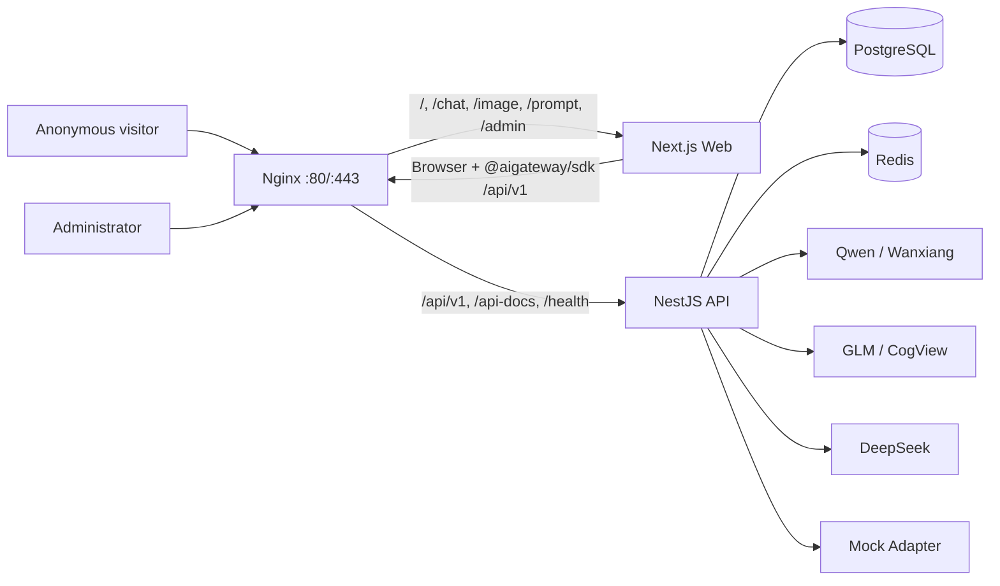
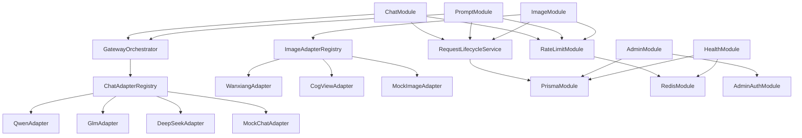
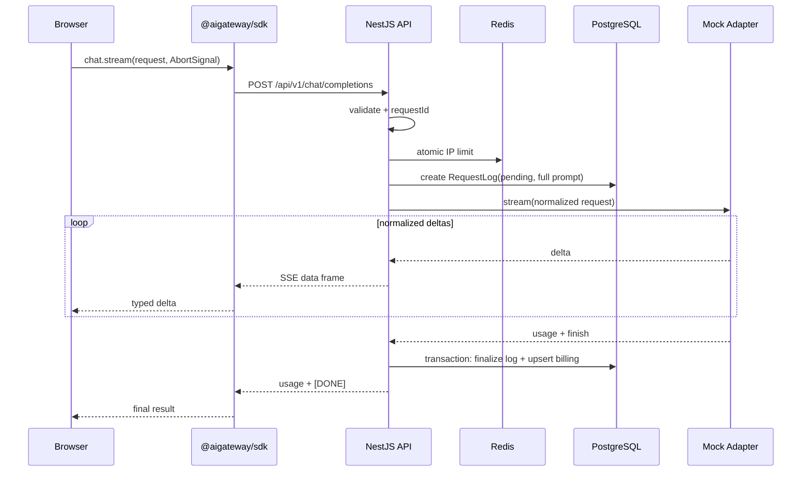

## Context

AI Gateway Studio 当前只有 [需求文档](../../../spec/需求文档.md) 和 [技术选型方案](../../../spec/技术选型方案.md)，尚未创建应用代码。产品由两个入口组成：匿名访客使用 Chat、文生图和 Prompt 优化；固定管理员进入 `/admin` 查看运行情况、完整请求详情并维护白名单业务数据。V1 的价值不是一次性覆盖所有模型，而是证明统一协议、SDK dogfooding、请求可观测和单机交付形成闭环。

已确认约束：

- 阿里云 ECS Ubuntu 4 核 8G 单机部署，Nginx 同时接受域名和公网 IP。
- Node.js 24 LTS、TypeScript、pnpm monorepo、Next.js、NestJS、PostgreSQL、Prisma、Redis、Pino 和 Docker Compose。
- Web 仅依赖一个内部包 `@aigateway/sdk`；模型厂商差异全部收敛在 API 的 Adapter 层。
- V1 接入 Qwen、GLM、DeepSeek、Wanxiang 和 CogView，但当前没有真实 API Key，因此 Mock 闭环不能依赖外部服务。
- V1 不使用 BullMQ；日志和计费同步直写 PostgreSQL；Redis 仅保存可重建的限流和健康状态。
- V1 完整保存 Prompt；管理员开发账号固定为 `root/123456`。成本硬顶、内容审核、正式认证和 Prompt 数据治理明确推迟。

主要使用者是匿名访客、项目管理员和维护 ECS 的开发者。设计需要让三者共用同一套部署，同时严格隔离公开数据和管理数据。

## Goals / Non-Goals

**Goals:**

- 先交付一条可重复验收的纵向主链路：Web → SDK → API → Mock Adapter → SSE → PostgreSQL 日志/计费。
- 以能力模块组织模块化单体，使新增厂商只增加 Adapter 和配置，不改变公开 SDK 契约。
- 为 Chat、Image、Prompt 和 Admin 定义清晰的控制器、服务、数据和错误边界。
- 使真实模型接入、对比模式和后台能力可以按里程碑增量上线，每一步都保持现有链路可运行。
- 在单机资源内提供可诊断、可备份、可回滚、支持域名/IP 的交付形态。

**Non-Goals:**

- 不在 V1 建立访客账号、管理员用户表、RBAC、多租户或对外发布 npm SDK。
- 不在 V1 引入 BullMQ、独立 Worker、Kubernetes、微服务或多机高可用。
- 不在 V1 实现全站小时/每日成本硬顶、代理池防刷、验证码/WAF、独立内容审核、Prompt 脱敏和自动清理。
- 不在 V1 接入 OpenAI、Claude、Gemini；Adapter 接口只为未来扩展保留稳定边界。
- 不承诺上游模型延迟和可用性，只约束平台自身开销、错误表达和故障转移边界。

## Architecture

### Runtime topology



Nginx 是唯一公网入口。Web 和 API 不直接暴露主机端口；PostgreSQL、Redis 只在 Compose 网络可见。浏览器通过同源 `/api/v1` 访问 API，域名和公网 IP 不需要两套前端配置。

### Source layout

```text
apps/
  web/                         # Next.js public site + /admin
  api/                         # NestJS modular monolith
packages/
  sdk/                         # @aigateway/sdk, public AI contracts/client
  config/                      # shared TS/eslint/tailwind config if needed
prisma/
  schema.prisma
  migrations/
infra/
  nginx/
  compose/
  scripts/                     # backup, restore, smoke checks
```

只有 `packages/sdk` 是业务 SDK。共享构建配置可以作为 workspace package，但不再拆分 Chat/Image/Prompt npm 包，也不引入包装各家模型的前端 SDK。

### API module boundaries



模块职责：

| 模块 | 负责 | 不负责 |
| --- | --- | --- |
| `ChatModule` | DTO 校验、SSE 生命周期、单模型/对比编排、取消 | 厂商字段、费用公式、后台查询 |
| `GatewayOrchestrator` | 模型选择、首 delta 边界、有限 failover、统一事件 | HTTP Controller、数据库 CRUD |
| `ProviderModule` | Adapter 注册、别名解析、厂商鉴权/协议/错误映射 | 页面状态和业务日志展示 |
| `ImageModule` | 创建任务、按查询驱动异步状态同步、持久化同步 provider 终态、下载代理 | 后台队列和长期对象存储 |
| `PromptModule` | mode 校验、版本化模板、调用 Gateway | 接收客户端任意 system Prompt |
| `RequestLifecycleModule` | 请求记录创建/终结、usage 和费用事务 | 模型传输 |
| `RateLimitModule` | 可信客户端 IP 解析、Redis 原子计数、429 | 全站成本硬顶和设备识别 |
| `AdminModule` | 聚合、日志详情、白名单表维护、审计 | 任意 SQL 和通用数据库控制台 |
| `HealthModule` | 应用/依赖/Provider 状态投影 | 决定已开始流的切换 |

Controller 只能依赖应用 Service；应用 Service 通过接口依赖 Adapter、Persistence、RateLimit 等端口。厂商响应类型不得越过 Adapter 边界。

## Main Flows

### First milestone: Mock streamed Chat vertical slice



关键提交点：限流和 `RequestLog(pending)` 成功后才允许调用模型，避免付费调用完全不可追踪。正常结束、失败、断连或取消都通过 `finally` 进入同一个终结逻辑。终结写入执行短次数重试；仍失败时写入 `critical` Pino 日志。V1 不引入异步补偿队列，因此“终结写失败可能留下 pending 记录”是已接受风险，后台需能筛选异常 pending。

### Real provider and failover

1. `ModelRegistry` 将稳定别名解析为启用的 Adapter、真实模型 ID、定价版本和可选 fallback。
2. `GatewayOrchestrator` 启动主 Adapter，并在向客户端发送第一个 content delta 前保留切换资格。
3. 仅超时或配置允许的 5xx 可触发一次 fallback；鉴权、参数、余额不足等错误不盲目切换。
4. 第一个 delta 写出后锁定 provider。随后错误通过 SSE error 事件结束，不能拼接另一个模型的内容。
5. 对比模式由 SDK 发起 2–3 个独立请求，每个请求有独立 request ID、AbortController 和日志；API 不把对比包装成一个隐藏的复合请求。

### Image generation without a queue

1. 提交前完成 DTO 校验和 Redis 限流。
2. API 创建 `ImageGenerationTask(pending)` 和请求日志，再调用 Image Adapter 创建上游任务。
3. 上游任务 ID 落库后返回平台 task ID。
4. SDK 以退避间隔调用状态接口；每次状态 GET 根据已持久化 provider/task ID 查询上游并幂等更新本地状态。
5. 终态不再访问上游。下载接口只接受平台 task ID 和 image index，服务端从已存结果白名单中解析上游 URL并代理内容。

此方案在 API 重启后仍可由客户端恢复轮询，代价是无人轮询的任务不会被主动刷新；该限制符合“不使用 BullMQ/Worker”的 V1 边界。

### Prompt optimization

Prompt 页面只提交 `{ prompt, mode }`。`PromptTemplateRegistry` 将 mode 解析为版本化 system template，然后调用与 Chat 相同的模型注册表、限流、日志、usage 和计费服务。该接口返回普通 JSON，不复用 Chat 的 `stream: true` 外部契约，但内部 Adapter 可按非流式或收集流结果实现。

### Admin mutation

管理前端先从 `/admin/tables` 获取服务端能力描述。PATCH/DELETE 到达后，API 再次校验表名、动作、主键和字段白名单，不信任前端能力描述。业务变更和 `AdminAuditLog` 在一个 Prisma 事务中提交；审计表不注册 PATCH/DELETE 能力。

## Data Design

| Entity | Key fields and invariants |
| --- | --- |
| `RequestLog` | `id/requestId` 唯一；capability、完整 prompt/messages JSON、alias、provider、resolvedModel、status、timings、failover、error；`createdAt` 索引 |
| `BillingRecord` | 与 `RequestLog` 一对一；input/output/total token、priceVersion、estimatedCostCny；允许 usageUnknown |
| `ImageGenerationTask` | 平台 task ID、provider task ID、prompt、alias、options、normalized status、results JSON、error、poll timestamps；终态不可逆 |
| `AdminAuditLog` | 只增不改；actor、action、targetTable、targetId、before/after JSON、requestId、IP、createdAt |

状态写入规则：

- `RequestLog`: `pending → succeeded | failed | cancelled`；后台可标记/筛选长时间 pending，但不自动伪造终态。
- `ImageGenerationTask`: `pending → running → succeeded | failed`，允许 `pending → succeeded | failed`；终态查询幂等。
- `BillingRecord` 与请求终结在同一事务 upsert，避免重复轮询或重试产生多条账单。
- 删除 `RequestLog` 时在事务内处理一对一 BillingRecord；删除 Image task 不应删除 AdminAuditLog。

索引优先支持后台查询：`RequestLog(createdAt,status,modelAlias,capability)`、`ImageGenerationTask(createdAt,status)`、`AdminAuditLog(createdAt,action,targetTable)`。不为完整 Prompt 建全文索引。

## SDK and API Contracts

`@aigateway/sdk` 的公开面按业务能力组织在一个包内：

```ts
interface AIGatewayClient {
  chat: {
    stream(input: ChatRequest, options?: { signal?: AbortSignal }): AsyncIterable<ChatEvent>
    compare(inputs: CompareRequest, options?: { signal?: AbortSignal }): CompareHandle
  }
  images: {
    create(input: ImageRequest): Promise<ImageTask>
    get(taskId: string): Promise<ImageTask>
    wait(taskId: string, options?: PollOptions): Promise<ImageTask>
    downloadUrl(taskId: string, index: number): string
  }
  prompts: {
    optimize(input: OptimizePromptRequest): Promise<OptimizePromptResult>
  }
  models: {
    list(): Promise<ModelSummary[]>
  }
}
```

SDK 负责 base URL、Fetch、POST SSE 解析、`[DONE]` 校验、typed error、AbortSignal、图片轮询和费用扩展解析；不负责保存页面聊天状态、渲染 Markdown、偷偷重试生成请求或持有厂商 API Key。

所有非流式错误使用统一 JSON envelope：`requestId`、`code`、`message`、`retryable`、可选 `details`。流打开前使用 HTTP 状态码；流打开后使用规范化 SSE error event。任何公开错误不得返回上游鉴权信息或堆栈。

## Decisions

### Decision 1: Modular monolith on one ECS host

采用 Next.js + NestJS 两个应用容器和共享数据服务，API 内部按能力模块化。相比微服务，它更适合 4C8G、单人维护和当前调用量，并保留通过 Adapter/Service 接口拆分的可能。相比把 API 写入 Next.js Route Handler，NestJS 更适合流式网关、Swagger、守卫、拦截器、Prisma 事务和后台模块的长期边界。

### Decision 2: One internal SDK as the only public Web client

Web 强制使用 `@aigateway/sdk`，用真实页面验证 SDK，而不是为每种能力建包。可选方案是直接在 React 组件 Fetch，初期代码少，但会让 SSE、错误、轮询和取消逻辑散落页面，无法证明网关调用契约稳定。

### Decision 3: Provider-neutral Adapter plus shared compatible transport

Chat Adapter 暴露统一 async iterable 事件。Qwen、GLM、DeepSeek 可复用内部 `OpenAICompatibleChatTransport`，但鉴权、模型映射和 usage/error mapping 仍由各 Adapter 持有。相比直接把某个官方 SDK 的类型作为领域模型，该方式减少供应商锁定，也避免 Web 安装多套 SDK。

### Decision 4: PostgreSQL as system of record, Redis as disposable control state

结构化请求、费用、图片任务和管理审计需要事务、关系约束、聚合与 JSON 字段，PostgreSQL 比 SQLite 更适合多容器并发、后台筛选和线上备份；比 MongoDB 更符合这些强关系数据。Redis 只做原子限流和短 TTL 健康状态，不承担不可丢失记录。

### Decision 5: Direct persistence, no BullMQ in V1

请求生命周期在 API 进程中同步创建和终结，图片状态由轮询请求驱动。这样能最快串通路径且减少 Worker/Redis 队列运维。代价是终结写失败没有持久化重放、无人轮询图片不会更新；等真实负载证明需要异步削峰、重试或后台刷新后再引入队列。

Wanxiang 使用厂商异步 task ID 并由客户端查询驱动状态推进。CogView-4 当前官方 HTTP API 同步返回图片 URL；其 Adapter 在已经创建平台 pending 记录后调用上游，并把同步响应作为提交终态在同一请求内持久化。平台仍返回统一 `ImageGenerationTask`，API 重启后直接从 PostgreSQL 读取终态，不使用进程内结果缓存，也不以其他模型冒充 CogView。

### Decision 6: Fetch stream rather than browser EventSource

Chat 使用 POST、请求体、AbortSignal 和响应状态检查，浏览器原生 EventSource 只适合 GET，因此 SDK 使用 Fetch `ReadableStream` + SSE parser。Nginx 对该路由关闭 buffering/cache。

### Decision 7: Fixed administrator only as a development flow

固定账号配合签名短期 HttpOnly Cookie，仅用于先验证后台授权链路。服务端仍集中实现 guard、登录限流、same-site cookie 和审计，便于以后将 credential verifier 换成密码哈希或外部身份认证。由于凭证已写入公开需求，正式对不受控网络开放管理后台前必须完成认证升级；不能把 IP 隐藏当成安全措施。

### Decision 8: Flow-first milestones over horizontal layer completion

每个阶段交付一个从 UI 到存储的可运行能力，先 Mock Chat，再真实单模型、对比、Image、Prompt、Admin 和部署。可选的“先写完数据库，再写完后端，再写完前端”会把集成风险推迟到最后，也无法在 API Key 缺失时获得早期反馈。

### Decision 9: Commit by task and push by product module

每个通过相应验证并勾选完成的 `tasks.md` checkbox 视为一个小功能点，完成后立即创建独立 Git commit，避免多个已完成能力长期堆积在未提交工作区。三个一级任务板块分别作为大模块：`1. API 网关服务建设`、`2. 管理员中后台`、`3. 用户端网页`；只有对应板块全部完成并通过模块验收后，才 push 该模块累计的 commits。提交和推送必须只包含当前工作范围，保留用户已有及其他无关改动。

### Decision 10: Provider health uses independent expiring projections

被动健康状态使用 `provider:health:{provider}` 独立 Redis key 保存 JSON 投影并设置短 TTL，而不是把所有 Provider 放入一个共享 Hash。独立 TTL 能让停止产生流量的 Provider 自然回到 `unknown`，避免其他活跃 Provider 刷新共享 key 时让陈旧状态长期存活。投影写入失败只记录告警，不改变已经开始的模型流；限流路径的 Redis fail-closed 规则保持不变。

## Failure Handling

| Failure | Platform behavior | Persistence |
| --- | --- | --- |
| DTO invalid / over rate | JSON 400/429，不调用 provider | 可仅写结构化 access log，不创建正式计费记录 |
| PostgreSQL create pending fails | 503，fail closed，不调用付费 provider | Pino critical |
| Redis unavailable | readiness false，公开 AI 请求 503 | PostgreSQL 历史不受影响 |
| Primary eligible failure before delta | 单模型最多切换一次；对比不切换 | 记录 from/to/reason |
| Provider failure after delta | SSE error 后结束，不拼接模型 | failed + partial timing/usage if known |
| Client disconnect/cancel | 中止读取并 best-effort abort upstream | cancelled |
| Final DB transaction fails | 有界重试，随后 critical 日志 | 可能保留 pending，后台可发现 |
| Image provider status unavailable | 返回 retryable 状态错误，不把 task 误标 failed | 保留最近已知状态 |
| Admin mutation/audit insert fails | 整个事务回滚 | 数据与审计均不提交 |

## Incremental Delivery Strategy

整体任务按产品责任边界划分为三个大板块：

1. **API 网关服务建设**：包含工程骨架、统一 SDK/协议、四张数据库表、Redis 限流、Mock/真实 Adapter、Chat SSE、Image 任务、Prompt 优化、日志计费、测试和 ECS 部署基础。
2. **管理员中后台**：包含固定管理员认证、Dashboard、请求日志、完整 Prompt 详情、数据库白名单编辑/删除和不可变审计日志。
3. **用户端网页**：包含公开首页、Chat 单模型/对比、文生图、Prompt 优化、响应式布局和主题。

三个板块是任务归类，不代表必须把一个板块全部做完才开始下一个。实际实施仍按以下波次推进：

1. **Wave A — 最小闭环（最高优先）**：完成网关板块的 workspace、PostgreSQL/Redis、四表迁移、Mock Chat、RequestLog/BillingRecord 和 SDK SSE；同时完成用户端最小 Chat 页面。无 API Key 时即可验收 Web → SDK → API → Mock Adapter → SSE → PostgreSQL。
2. **Wave B — 网关能力完善**：加入 Redis 限流、统一错误、usage/费用、首 delta failover，并按 Qwen → GLM → DeepSeek 逐个接入；每个 Adapter 独立通过 contract suite 和真实低额度冒烟。
3. **Wave C — 管理员中后台闭环**：按认证 guard → 日志列表/详情 → Dashboard → 白名单表维护 → 原子审计实施，所有接口先验证未授权不可访问。
4. **Wave D — 用户能力扩展**：完成 Chat 多模型对比；Image 先 Mock 提交/轮询/持久化/下载，再接 Wanxiang/CogView；Prompt 优化复用网关、计费和日志。
5. **Wave E — 单机上线验收**：完成生产 Compose、Nginx SSE、日志轮转、备份恢复、IP/域名和人工发布/回滚 runbook，在 ECS 运行完整冒烟。

Wave A 是第一个必须完成的演示基线。之后未完成页面或未购买 Key 的模型均通过 feature flag/disabled model state 隐藏，不影响已经串通的能力。

## Risks / Trade-offs

- [固定 `root/123456` 可被公开猜中] → 仅作为开发联调开关；管理路由默认不应在正式公开环境以该凭证启用，认证升级列为上线前硬门槛。
- [V1 缺少全站成本硬顶，代理 IP 可绕过单 IP 限流] → 真实 Key 接入阶段使用低额度供应商账户和可禁用 provider 开关；全站小时/每日硬顶在后续 change 实现。本 change 不声称解决防刷。
- [V1 缺少输入/图片内容审核] → 文生图正式开放给不受控用户前增加独立审核链路；当前仅验证技术流程。本 change 不把上游模型自带拦截视为合规保证。
- [完整 Prompt 同时进入数据库和日志] → 只允许认证详情接口展示，配置 Docker 日志轮转且不做全文索引；脱敏、权限分级和清理策略后续实现。
- [单机故障造成全站不可用] → PostgreSQL 持久卷与外部备份、镜像回滚、Compose 快速重建；V1 接受无高可用。
- [同步写库增加首包延迟] → 仅在 provider 前执行必要的 pending insert，索引保持精简并监控平台 TTFB；不为了延迟牺牲付费调用可追踪性。
- [无 Worker 导致图片任务依赖客户端轮询] → task/provider ID 持久化并使 GET 幂等；将主动刷新和重试留到明确需要 BullMQ 时。
- [三家兼容接口仍有边缘差异] → 每个 Adapter 使用录制的去敏响应 fixture 和共享 contract suite，禁止业务 Service 读取原始厂商类型。
- [Nginx 缓冲破坏 SSE] → 配置专项 smoke test，以延迟 Mock chunks 验证首 chunk 和连续到达，而不是只检查最终文本。
- [4C8G 资源竞争] → Compose 资源限制、PostgreSQL 连接池上限、Next/Nest 单实例起步、按实测再调整；不预设多副本。

## Migration Plan

仓库无现存应用和生产数据，因此初始迁移采用从零构建：

1. 创建 workspace 和 Compose 基础设施，提交可重复的 Prisma 初始迁移。
2. 以 Mock-only 配置部署 M1，不配置真实 Key；通过 E2E 后形成首个可回滚镜像标签。
3. 每次新增表/字段均使用向后兼容迁移：先加可空字段/新表，再发布读取代码，最后在后续版本收紧约束。
4. 真实 Adapter 按单个 feature flag 启用；失败可关闭对应 alias 回退到 Mock 或其他已验证模型，不需要回滚 SDK。
5. ECS 更新前执行 PostgreSQL 备份，拉取已标记镜像/代码，运行迁移和 `docker compose up -d`，再执行 health、SSE、持久化和 admin guard 冒烟。
6. 冒烟失败时先关闭新 Adapter/功能；若应用版本不兼容则回退上一镜像。只有不可向后兼容的数据迁移失败时才从备份恢复数据库。

## Open Questions

- 三家国内厂商最终购买哪种账户、地域、模型 ID、额度和实时单价；这些不阻塞 M0–M1，但阻塞对应真实 Adapter 验收。
- Wanxiang/CogView 结果 URL 的有效期、下载大小限制和允许的响应类型，需要在拿到真实账户后用 provider fixture 确认。
- 已配置域名的实际 server name、ICP 备案状态和 HTTPS 证书方案，在 M7 部署联调时写入环境配置和 runbook。
- 正式公开演示前，是先完成管理员认证升级与内容审核，还是临时关闭 `/admin` 公网入口和真实文生图；该发布决策不影响本次开发流程设计，但影响公网开放范围。
